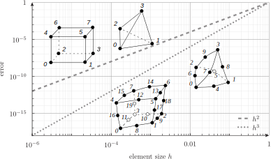
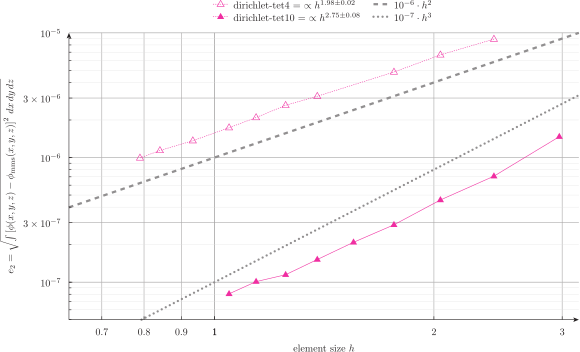
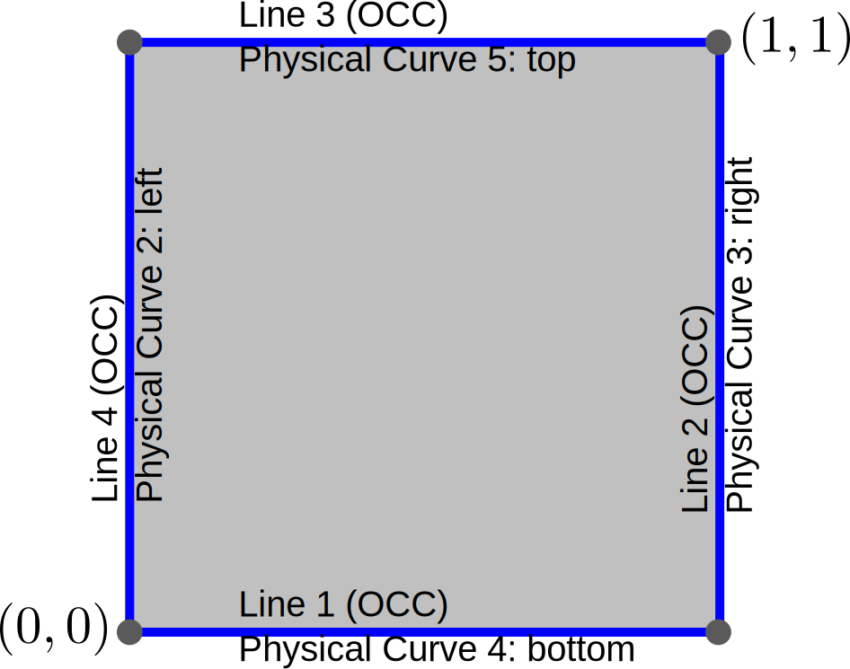
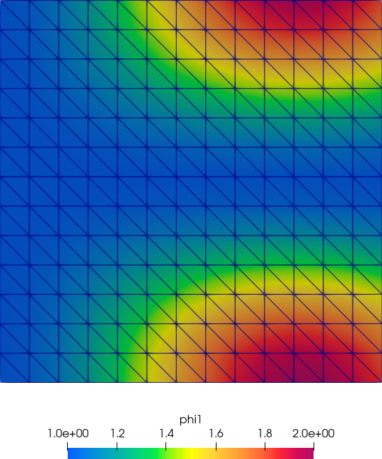
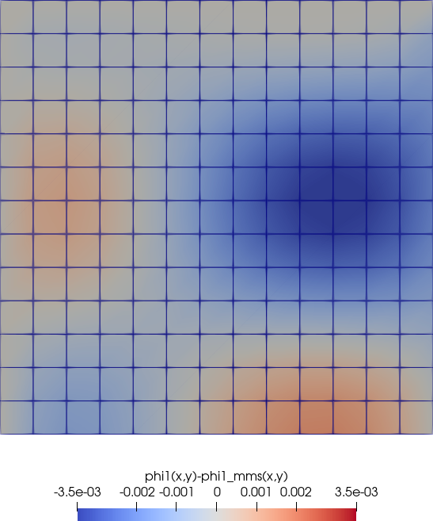
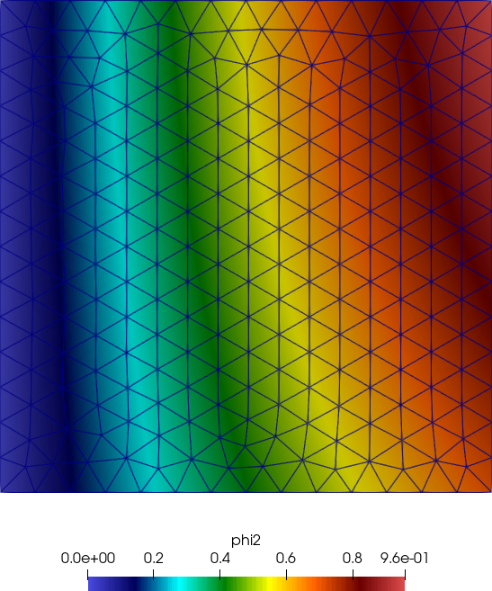
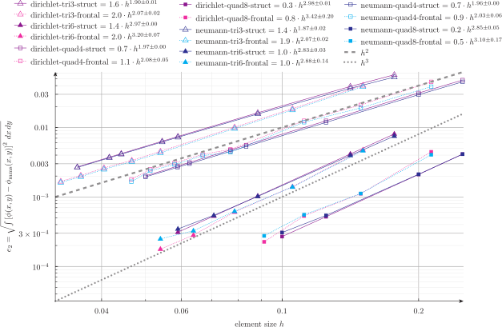

---
title: Verification of multigroup neutron diffusion codes with MMS
subtitle: (MMS = Method of Manufactured Solutions)
author: Germán (Jeremy) Theler
institute: Grupo Argentino de Cálculo y Análisis de Reactores---Reunión Anual 2023
email: jeremy@seamplex.com
aspectratio: 169
lang: en-US
theme: default
innertheme: rectangles
fonttheme: professionalfonts
outertheme: number
colorlinks: true
sansfont: Carlito
monofont: DejaVuSansMono
header-includes: \include{syntax-feenox.tex}\include{syntax.tex}\usepackage{hf-tikz}
nocite: |
  @roache, @sandia, @asme-vv10, @asme-vv20, @asme-vv40
bibliography: references.bib
...


## Dependencies: <https://seamplex.com/feenox>

### FeenoX

 * FeenoX Overview Presentation. August 2021
   - <https://youtu.be/-RJ5qn7E9uE>
 * FeenoX for nuclear-related problems Presentation. December 2021
   - <https://youtu.be/e8kFmFOsbPk>
 * FeenoX hands-on tutorial. Science Circle, on-line course. October 2022
   - <https://youtu.be/b3K2QewI8jE>
 * FeenoX, a cloud-first free and open source finite-element(ish) tool. Science Circle, on-line course. November 2022.
   - <https://youtu.be/EZSjFzJAhbw>
 * A cloud-first approach for solving core-level neutron transport. December 2022.
   - <https://youtu.be/rdZtyMf5m0k>
   
### MMS

 * Verification of PDE solvers with the Method of Manufactured Solutions. November 2023.
   - <https://youtu.be/mGNwL8TGijg>

## 

\centering 

## Verification & Validation

\renewcommand{\vec}{\mathbf}
\renewcommand{\thefigure}{}

### Verification

The process of determining that a model implementation accurately represents the developer’s conceptual description of the model and the solution to the model.

\vspace{0.5cm}

> Are we solving **right the** equations?

### Validation

The process of determining the degree to which a model is an accurate representation of the real world from the perspective of the intended uses of the model.

\vspace{0.5cm}

> Are we solving **the right** equations?


## Verification & Validation


### Verification {.alert}

The process of determining that a model implementation accurately represents the developer’s conceptual description of the model and the solution to the model.

\vspace{0.5cm}

> **Are we solving right the equations?**

### Validation

The process of determining the degree to which a model is an accurate representation of the real world from the perspective of the intended uses of the model.

\vspace{0.5cm}

> Are we solving **the right** equations?

## 

\centering 

## What does "verification" mean?

::: {#refs}
::: 

. . .

### TL;DR

Compare the numerical results with the analytical solutions.

## 

\centering 


## What does "verification" mean?

 * The "error" goes $\rightarrow 0$ as the mesh density $\rightarrow \infty$
 
. . .

 * *Lax-Richtmyer equivalence theorem*

   | If a numerical method is consistent, then it converges if and only if it is stable.
   | Even more, any two of these three properties imply the third one.

. . . 

 * Recommendation:
 
   > “... we recommend that one should demonstrate that the equations are solved to the
   >  _theoretical order-of-accuracy_ of the discretization method.” (Sandia National Lab)

  

## 

\centering 


## 

{width=90%}

## 

{width=90%}

## 

{width=90%}


## 

\centering 

 
## Recipe for code verification

 1. Solve a PDE with the your code and obtain the numerical solution, say $\phi(\vec{x})$.
 
 2. Compute the error, e.g. $L_2$ error
 
    $$
    e_2 = \frac{\sqrt{\displaystyle \int \left[ \phi(\vec{x})-\phi_\text{exact}(\vec{x}) \right]^2 \, d^3\vec{x}}}{\displaystyle \int \, d^3{\vec{x}}}
    $$

 3. Repeat steps 1-2 with smaller element sizes $h$ and record the pairs $(h, e_2)$
 
 4. Plot $\log(e_2)$ vs. $\log(h)$ and fit the slope

## Are we done?

:::::::::::::: {.columns}
::: {.column width="35%"}

\vspace{0.5cm}
\centering 

:::

::: {.column width="65%"}

 
 * is the range of the element sizes reasonable?
 * where's the round-off error plateau?
 * is the error measure well defined?
 * did we test all the features of our solver?
   - linear and non-linear cases?
   - structured and unstructured grids?
   - essential and natural BCs? all types of natural BCs?
   - space and or time-dependent material properties?
   - different element types?
   - other features such as
     - glue
     - released degrees of freedom
     - rigid bodies
     - remote loads
     - etc.
:::
::::::::::::::
     

## Deal breaker

$$
e_2 = \frac{\sqrt{\displaystyle \int \left[ \phi(\vec{x}) - \tikzmarkin<2->{a1} \phi_\text{exact}(\vec{x}) \tikzmarkend{a1} \right]^2 \, d^3\vec{x}}}{\displaystyle \int \, d^3{\vec{x}}}
$$
    
. . .

\centering {width=40%}


## The Method of the Manufactured Solutions

$$
-\text{div}\Big[ D_g(\vec{x}) \cdot \text{grad} \left[ \phi_g(\vec{x}) \right] \Big] + \Sigma_{ag} \cdot \phi_g(\vec{x}) - \sum_{g^{\prime}=1}^G \Sigma_{s g^{\prime} \rightarrow g} \cdot \phi_{g^{\prime}}(\vec{x}) = s_g(\vec{x})
$$

. . .

 * Our job: given $s_g(\vec{x})$ find $\phi_g(\vec{x})$
 
   - How? "integrate twice" $\rightarrow$ it's hard!
 
. . .


 * Inverse path: given $\phi_g(\vec{x})$ find $s_g(\vec{x})$
 
   - How? "differentiate twice" $\rightarrow$ it's easy!

## MMS for 3D one-group diffusion

 1. Propose (i.e. _manufacture_) a solution

    \vspace{-0.5cm}
    $$
    \phi(x,y,z) = \log\left[ 1 + 10^{-2} \cdot z \cdot (y+50)\right] + 10 \cdot ( x + \sqrt{y+50})
    $$
    
. . .

 2. Give material properties (let's keep it easy for now)
 
    \vspace{-0.5cm}
    $$
    \begin{aligned}
    D_1(x,y,z) &= 1 \\
    \Sigma_{a1}(x,y,z) &= 0.05 
    \end{aligned}
    $$
    
. . .

 3. Compute the source
 
    \vspace{-0.5cm}
    $$
    \begin{aligned}
    S(x,y,z) =& 
    0.05\,\left(\log \left(0.01\,\left(y+50\right)\,z+1\right)
    + 0.001\, \left(\sqrt{y+50}+ 
     x\right)\right)\\
    & +{{1.0 \times 10^{-4}\,z^2}\over{
     \left(0.01\,\left(y+50\right)\,z+1\right)^2}}
    +{{1.0 \times 10^{-4}\,
     \left(y+50\right)^2}\over{\left(0.01\,\left(y+50\right)\,z+1\right)^
     2}}
    +{{2.5 \times 10^{-4}}\over{\left(y+50\right)^{{{3}\over{2}}}}}
    \end{aligned}
    $$
 
## 

\centering 


## Checklist

 1. A solver with support for algebraic expressions
 
. . .

 2. Either
 
     a. calculus skills, or
     b. symbolic math software (i.e. Maxima)
        - extra grade if the syntax is the same as the solver's in point #1
     
. . .

 3. Either
 
     a. patience to run a parametric loop over $h$
     b. scripting skills 
        - depending on the script-friendlyness of the solver in point #1

## Recipe for MMS

 1. Propose $\phi_\text{mms}(\vec{x})$, $D(\vec{x})$ and $\Sigma_a(\vec{x})$:
 
    ```terminal
    $ maxima
    (%i1) phi1_mms(x,y,z) := log(1+1e-2*z*(y+50)) + 1e-3*(x+sqrt(y+50));
    (%o1) phi1_mms(x, y, z) := log(1 + 0.01 z (y + 50)) + 0.001 (x + sqrt(y + 50))
    (%i2) D1(x,y,z) := 1;
    (%o2)                          D1(x, y, z) := 1
    (%i3) Sigma_a1(x,y,z) := 0.05;
    (%o3)                      Sigma_a1(x, y, z) := 0.05
    ```

## Recipe for MMS
 
 2. Compute $s(\vec{x})$ (and eventually $-D \nabla \phi$)

    ```terminal
    (%i4) s1(x,y,z) := -(diff(D1(x,y,z) * diff(phi1_mms(x,y,z), x), x) + diff(D1(x,y,z) * diff(phi1_mms(x,y,z), y), y) + diff(D1(x,y,z) * diff(phi1_mms(x,y,z), z), z)) + Sigma_a1(x,y,z)*phi1_mms(x,y,z);
    (%o4) s1(x, y, z) := (- (diff(D1(x, y, z) diff(phi1_mms(x, y, z), x), x)
     + diff(D1(x, y, z) diff(phi1_mms(x, y, z), y), y)
     + diff(D1(x, y, z) diff(phi1_mms(x, y, z), z), z)))
     + Sigma_a1(x, y, z) phi1_mms(x, y, z)
    (%i5) s1(x,y,z);
    (%o5) 0.05 (log(0.01 (y + 50) z + 1) + 0.001 (sqrt(y + 50) + x))
                                    2                            2
                            1.0E-4 z              1.0E-4 (y + 50)         2.5E-4
                    + ---------------------- + ---------------------- + -----------
                                           2                        2           3/2
                      (0.01 (y + 50) z + 1)    (0.01 (y + 50) z + 1)    (y + 50)
    (%i6) 
    ```

## Recipe for MMS

 3. (optional) Convert it to TeX so you can create a Beamer slideshow
  
    ```terminal
    (%i6) tex(s1(x,y,z));
    $$0.05\,\left(\log \left(0.01\,\left(y+50\right)\,z+1\right)+0.001\,
     \left(\sqrt{y+50}+x\right)\right)+{{1.0 \times 10^{-4}\,z^2}\over{
     \left(0.01\,\left(y+50\right)\,z+1\right)^2}}+{{1.0 \times 10^{-4}\,
     \left(y+50\right)^2}\over{\left(0.01\,\left(y+50\right)\,z+1\right)^
     2}}+{{2.5 \times 10^{-4}}\over{\left(y+50\right)^{{{3}\over{2}}}}}$$
    (%o6)                                false
    ```
     
. . . 
     
 4. Convert the output to an ASCII string so we can copy & paste (or `sed`, `m4`, etc.)
  
    ```terminal
    (%i7) stringout("neutron-bunny-s1.txt", s1(x,y,z));
    $ cat neutron-bunny-s1.txt 
    0.05*(log(0.01*(y+50)*z+1)+0.001*(sqrt(y+50)+x))+(1.0E-4*z^2)/(0.01*(y+50)*z+1)^2+(1.0E-4*(y+50)^2)/(0.01*(y+50)*z+1)^2+2.5E-4/(y+50)^(3/2);
    $ 
    ```

## Recipe for MMS
 

 5. Choose a domain and decide what type of BCs to apply

. . . 
 
:::::::::::::: {.columns}
::: {.column width="55%"}
 
\centering {width=80%}
 
:::
 
::: {.column width="45%"}
 
\vspace{2cm}
 
 * Fixed flux equal to $\phi_\text{mms}(\vec{x})$
  
   - throughout the external surface
:::
::::::::::::::
  

## Recipe for MMS

 6. Prepare the input for your solver (FeenoX)

    ```feenox
    PROBLEM neutron_diffusion 3D
    
    phi1_mms(x,y,z) = log(1+1e-2*z*(y+50)) + 1e-3*(x+sqrt(y+50))
    D1(x,y,z) = 1
    Sigma_a1(x,y,z) = 0.05
    
    [...]
    
    # source
    S1(x,y,z) = 0.05*(log(0.01*(y+50)*z+1) + 0.001*(sqrt(y+50)+x)) + (1.0E-4*z^2)/(0.01*(y+50)*z+1)^2 + (1.0E-4*(y+50)^2)/(0.01*(y+50)*z+1)^2 + 2.5E-4/(y+50)^(3/2)
    
    # set Dirichlet BC
    BC external phi1=phi1_mms(x,y,z)
    
    [...]
    ```
    
     * extra grade to Maxima & FeenoX for having the same ASCII syntax!
  
## Recipe for MMS

 7. Loop over mean element size $h \rightarrow 0$ 

     a. mesh
     b. solve
     c. compute the $L_2$ error with respect to the manufactured $\phi_\text{mms}(\vec{x})$
        $$
        e_2 = \frac{\sqrt{\displaystyle \int \left[ \phi(x,y) - \phi_\text{mms}(x,y) \right]^2 \, dx \, dy \, dz}}{\displaystyle \int  \, dx \, dy\, dz}
        $$

. . .

  8. Plot $\log(e_2)$ vs. $\log(h)$
  
. . .

  9. Fit the slope 
  
. . .

  10. Show off your results! (if they match the theory)

## 

```terminal
$ ./run.sh 
# manufactured solution (input)
phi1_mms(x,y,z) := log(1+1e-2*z*(y+50)) + 1e-3*(x+sqrt(y+50));
D1(x,y,z) := 1;
Sigma_a1(x,y,z) := 0.05;
# source term (output)
S1(x,y,z) = 0.05*(log(0.01*(y+50)*z+1)+0.001*(sqrt(y+50)+x))+(1.0E-4*z^2)/(0.01*(y+50)*z+1)^2+(1.0E-4*(y+50)^2)/(0.01*(y+50)*z+1)^2+2.5E-4/(y+50)^(3/2)
neutron_bunny_tet4
0.882892        -2.913390       -11.628276      20      19682   4707
0.713751        -3.078327       -11.919410      24      32742   7373
[...]
-0.236015       -3.197992       -13.823714      64      567349  103924
neutron_bunny_tet10
1.345444        -1.999232       -11.668375      12      4933    8922
1.092143        -2.130628       -12.250770      16      10558   17898
[...]
0.131448        -3.886458       -14.788972      44      188504  273940
0.045929        -3.739021       -15.018699      48      243633  351128
$ 
```
  
## Some results for the bunny: $c=20$

:::::::::::::: {.columns}
::: {.column width="50%"}
\centering {width=80%}
:::


::: {.column width="50%"}
\centering {width=80%}
:::
::::::::::::::

## Some results for the bunny: $c=100$

:::::::::::::: {.columns}
::: {.column width="50%"}
\centering {width=80%}
:::


::: {.column width="50%"}
\centering {width=80%}
:::
::::::::::::::


## 

\ 

## MMS for 2D two-group diffusion

:::::::::::::: {.columns}
::: {.column width="65%"}

```feenox
phi1_mms(x,y) = 1 + sin(2*x)^2 * cos(3*y)^2
D1(x,y) = 1 + 0.1*(x - 0.5*y)
Sigma_a1(x,y) = 1e-3*(1 + log(1+x) - 0.5*y^3)
Sigma_s1_2(x,y) = 1e-3*(1 - x + sqrt(0.5*y))

phi2_mms(x,y) = (1-0.5*tanh(-y))*log(1+x)
D2(x,y) = 1
Sigma_a2(x,y) = 1e-3
Sigma_s2_1(x,y) = 0

BC left   phi1=phi1_mms(x,y)    phi2=phi2_mms(x,y)
BC top    phi1=phi1_mms(x,y)    phi2=phi2_mms(x,y)
BC bottom J1=+Jy1_mms(x,y)      J2=+Jy2_mms(x,y)
BC right  J1=-Jx1_mms(x,y)      J2=-Jx2_mms(x,y)
```
:::


::: {.column width="35%"}

\vspace{1cm}

{width=100%}

:::
::::::::::::::


## 

```terminal
$ ./run.sh 
# manufactured solution (input)
phi1_mms(x,y) := 1 + sin(2*x)^2 * cos(3*y)^2;
phi2_mms(x,y) := (1-0.5*tanh(-y))*log(1+x);
D1(x,y) := 1 + 0.1*(x - 0.5*y);
Sigma_a1(x,y) := 1e-3*(1 + log(1+x) - 0.5*y^3);
Sigma_s1_2(x,y) := 1e-3*(1 - x + sqrt(0.5*y));
D2(x,y) := 1;
Sigma_a2(x,y) := 1e-3;
Sigma_s2_1(x,y) := 0;
# source terms (output)
S1(x,y) = (-18*sin(2*x)^2*(0.1*(x-0.5*y)+1)*sin(3*y)^2)-0.3*sin(2*x)^2*cos(3*y)*sin(3*y)+0.001*((-0.5*y^3)+log(x+1)+1)*(sin(2*x)^2*cos(3*y)^2+1)+26*sin(2*x)^2*(0.1*(x-0.5*y)+1)*cos(3*y)^2-8*cos(2*x)^2*(0.1*(x-0.5*y)+1)*cos(3*y)^2-0.4*cos(2*x)*sin(2*x)*cos(3*y)^2
S2(x,y) = (-0.001*(0.7071067811865476*sqrt(y)-x+1)*(sin(2*x)^2*cos(3*y)^2+1))+1.0*log(x+1)*sech(y)^2*tanh(y)+0.001*log(x+1)*(0.5*tanh(y)+1)+(0.5*tanh(y)+1)/(x+1)^2
J1x(x,y) = 4*cos(2*x)*sin(2*x)*((-0.1*(x-0.5*y))-1)*cos(3*y)^2
J1y(x,y) = -6*sin(2*x)^2*((-0.1*(x-0.5*y))-1)*cos(3*y)*sin(3*y)
J2x(x,y) = -(0.5*tanh(y)+1)/(x+1)
J2y(x,y) = -0.5*log(x+1)*sech(y)^2
```

## 

:::::::::::::: {.columns}
::: {.column width="50%"}
\centering {width=50%}

\centering {width=50%}

:::


::: {.column width="50%"}
\centering {width=50%}

\centering {width=50%}
:::
::::::::::::::

## 

\ 

## Conclusions

:::::::::::::: {.columns}
::: {.column width="65%"}

 * The MMS provides the exact solution of the PDE...
   - needed to compute the error...
     - needed to verify the numerical solver.

. . .

 * It does so by taking the "inverse" path
   - what source do I need to get a certain solution?

. . .

 * Works for linear an (some) non-linear PDEs
   - Thinks like mixed formulations and eigen problems need some extra work 
   - Non-linear mechanical material models are hard
   
. . .
   
 * Do mind...
   - the choice of the mesh size $h$
     - maybe use the total number of DOFs?
   - the computation of the error
   - the tolerance of the iterative solvers

:::

::: {.column width="35%"}

\ 

\centering \ 


:::
::::::::::::::
   
## Conclusions

 * The MMS provides a way for users to verify our codes by themselves!
   - Even if they do not fulfill the checklist, they have **the freedom** to hire someone who does
   - It is a way to get third-party independent verifications
 
. . .

 * Follow-up links
 
   - FeenoX MMS directory
     - <https://github.com/seamplex/feenox/tree/main/tests/mms>
   
   - Section 6.9 of my PhD Thesis "Neutron transport in the cloud"
     - <https://seamplex.com/thesis/html/060-resultados/README.html#sec-mms-dif>
   
